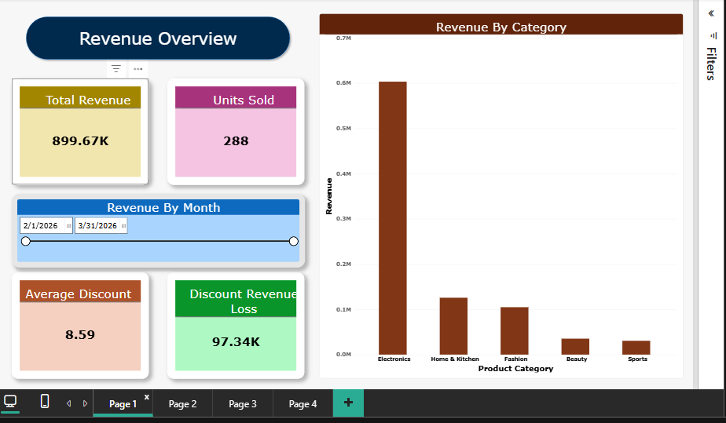
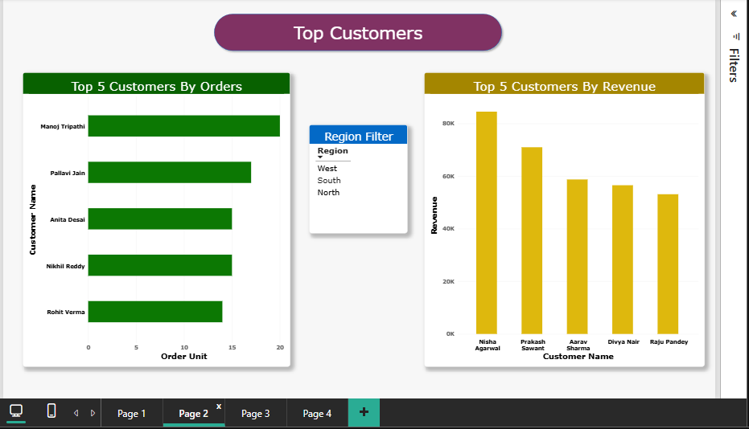
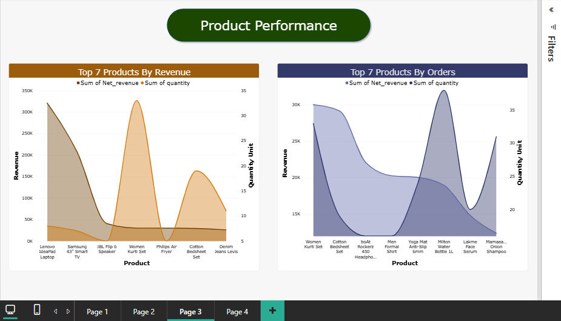
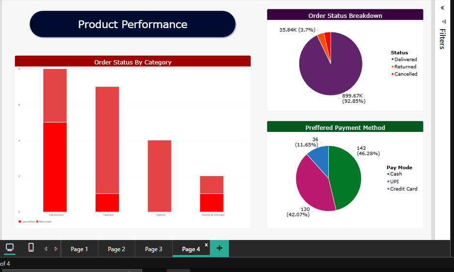

# E-Commerce Customer Order & Revenue Analysis

## Project Overview
Designed and analyzed a two-month e-commerce sales database to uncover 
customer behavior, regional performance, product profitability, and revenue 
trends; simulating a real business analytics workflow end-to-end.

## Tools Used
- SQL (MySQL Workbench)
- Power BI

## Database Design
- 3-table relational database: Orders, Customers, Products
- Connected via foreign keys
- 150 orders | 30 customers | 20 products | 5 categories

## Key Findings
- Electronics was the top revenue category at ₹6,03,348
- Top customer Nisha Agarwal spent ₹84,481 (filtered on delivered orders)
- West region dominated both revenue and order volume
- February outperformed March by ₹50,989 despite fewer orders
- ₹97,342 in discount-driven revenue loss identified across product categories

## SQL Concepts Used
## Project Files
- `Ecom_project_script.sql` —> All SQL queries with findings documented
- Multi-table JOINs
- Window Functions
- Subqueries
- GROUP BY / HAVING
- VIEWs

## Power BI Dashboard

### Page 1 — Revenue Overview

### Page 2 — Top Customers

### Page 3 — Product Performance

### Page 4 — Order Status & Payment Analysis

