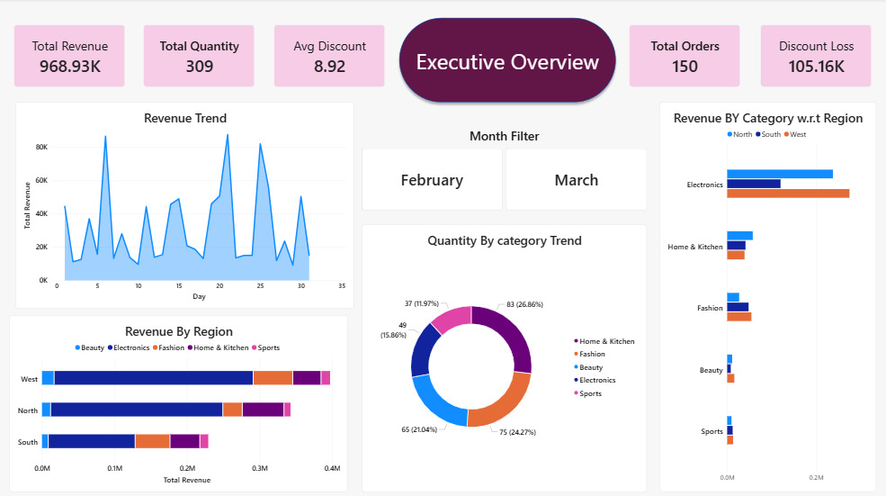
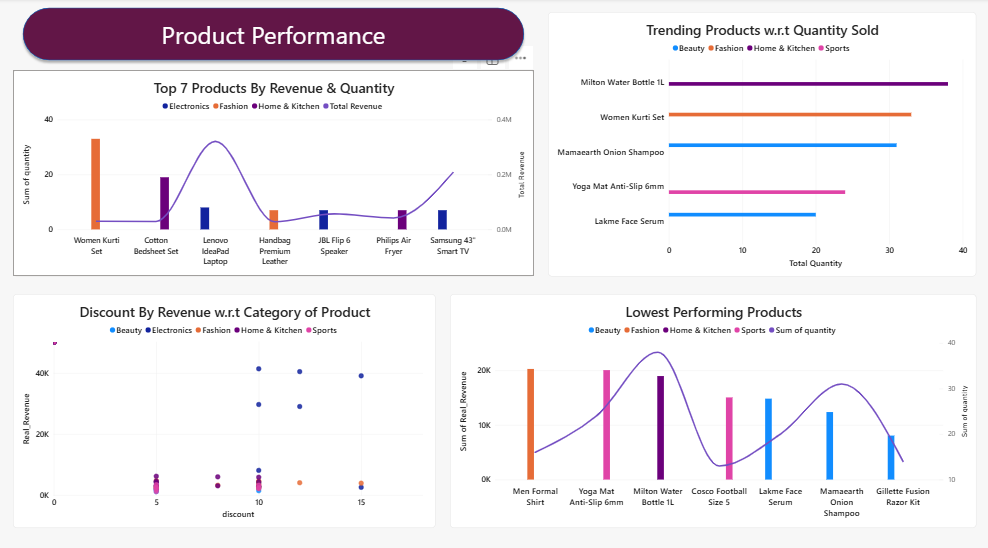
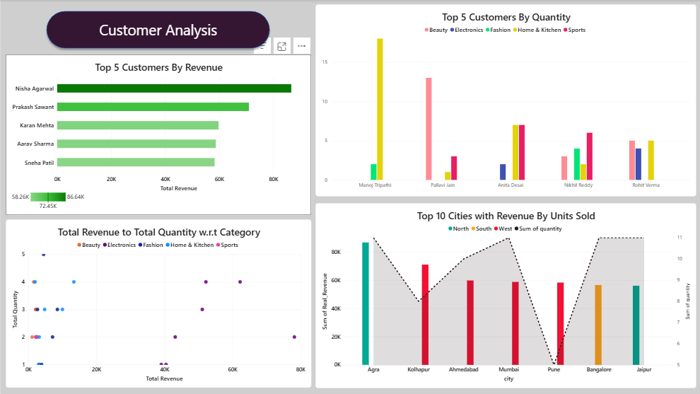
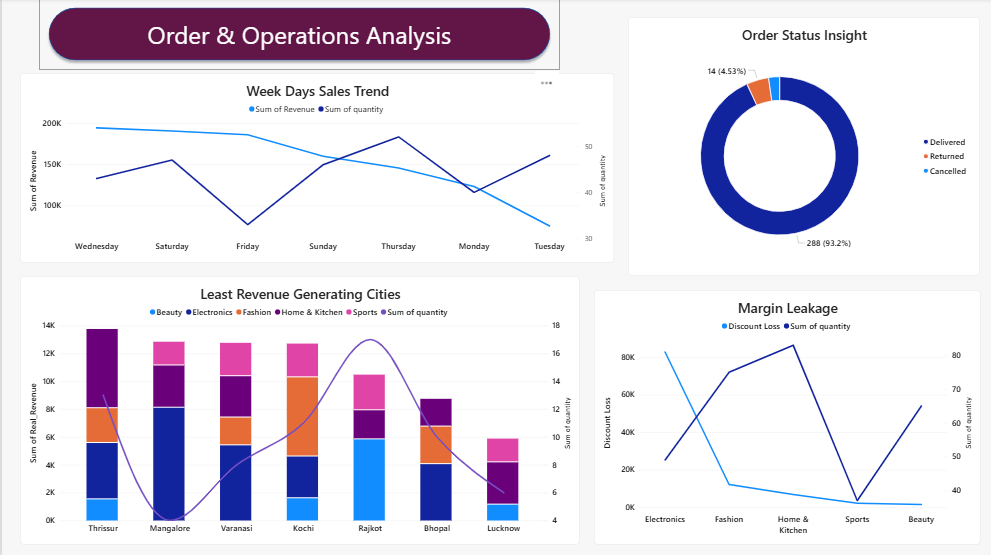

# 🛒 E-Commerce Customer Order & Revenue Analysis

> **Tools:** SQL · MySQL Workbench · Power BI
> **Dataset:** Self-designed e-commerce sales database
> **Records:** 150 orders · 30 customers · 20 products · 5 categories · 2 months (Feb–Mar 2026)

---

## 📌 Project Overview

This project is an end-to-end e-commerce sales analysis covering customer spending behaviour, regional performance, product profitability, order health, and margin leakage : built on a self-designed relational database and visualised through a 4-page interactive Power BI dashboard.

The dataset was designed to simulate a realistic Indian e-commerce platform with products across Electronics, Fashion, Home & Kitchen, Beauty, and Sports categories : covering customers across North, South, and West regions.

---

## 🗂️ Dataset Details

| Attribute | Details |
|---|---|
| Source | Self-designed relational database |
| Period | February ; March 2026 |
| Total Orders | 150 |
| Customers | 30 (across 3 regions : North, South, West) |
| Products | 20 (across 5 categories) |
| Cities | 30 cities across India |
| Order Statuses | Delivered, Returned, Cancelled |
| Payment Modes | Cash, UPI, Credit Card, Debit Card |

---

## 🔑 Key Business Questions Answered

| # | Question | Finding |
|---|---|---|
| Q1 | Which product category generated highest revenue? | Electronics : Rs. 6,03,348 net revenue |
| Q2 | Who are the top 5 customers by spending? | Nisha Agarwal leading at Rs. 84,481 (delivered orders) |
| Q3 | Which region contributes most revenue? | West region : dominant in both revenue and orders |
| Q4 | Which month performed better? | February : outperformed March by Rs. 50,989 in net revenue |
| Q5 | How much revenue was lost to discounts? | Rs. 97,342 discount-driven revenue loss |
| Q6 | What is the return and cancellation rate? | 93.2% delivered · 4.53% returned · 2.27% cancelled |
| Q7 | Which product generates high revenue at low volume? | Lenovo IdeaPad Laptop : top revenue, not top quantity |
| Q8 | Which payment mode is most preferred? | UPI : 46.28% of transactions |

---

## 🛠️ SQL Techniques Used

- `GROUP BY` with `COUNT`, `SUM`, `AVG` for aggregations
- `WINDOW FUNCTIONS` : `SUM() OVER(PARTITION BY ...)` for regional and category totals
- `JOIN` operations across orders, customers, and products tables
- `SQL VIEWS` : created reusable view filtering delivered orders only
- `SUBQUERIES` with `HAVING` clause for product-level margin analysis
- `MONTH()` date function for February vs March comparison
- `WHERE` clause filtering by order status for net revenue accuracy
- `COUNT(DISTINCT)` for unique product and customer analysis

---

## 📈 Power BI Dashboard : 4 Pages

### Page 1 : Executive Overview

- **KPI Cards:** Total Revenue (968.93K), Total Quantity (309), Avg Discount (8.92), Total Orders (150), Discount Loss (105.16K)
- **Revenue Trend** : daily area chart across Feb-Mar 2026
- **Revenue by Region** : stacked bar: West dominant across all categories
- **Month Filter Slicer** : interactive February / March toggle
- **Quantity by Category Donut** : Home & Kitchen (26.86%), Sports (24.27%), Beauty (21.04%), Electronics (15.86%), Fashion (11.97%)
- **Revenue by Category w.r.t Region** : clustered bar showing category-region revenue breakdown

---

### Page 2 : Product Performance

- **Top 7 Products by Revenue & Quantity** : dual-axis chart: Lenovo IdeaPad Laptop leads revenue despite moderate quantity
- **Trending Products by Quantity Sold** : Milton Water Bottle and Women Kurti Set top volume sellers
- **Discount by Revenue Scatter Plot** : reveals pricing sensitivity per category
- **Lowest Performing Products** : dual-axis chart identifying underperforming SKUs for inventory decisions

---

### Page 3 : Customer Analytics

- **Top 5 Customers by Revenue** : Nisha Agarwal (North) and Prakash Sawant (West) leading; region breakdown visible
- **Top 5 Customers by Quantity** : Manoj Tripathi and Pallavi Jain leading by order volume with category breakdown
- **Revenue vs Quantity Scatter Plot** : category-level relationship between order value and volume
- **Top 10 Cities by Revenue & Units Sold** : dual-axis: Agra leads revenue; Mumbai and Kolhapur strong in quantity

---

### Page 4 : Order & Operations Analysis

- **Weekday Sales Trend** : dual-axis line chart: Wednesday highest revenue day; Tuesday lowest
- **Order Status Donut** : 93.2% Delivered · 4.53% Returned · 2.27% Cancelled
- **Least Revenue Generating Cities** : stacked bar: Thrissur, Mangalore, Varanasi identified as low-revenue markets
- **Margin Leakage by Category** : dual-axis: Electronics and Home & Kitchen show highest discount-driven revenue loss

---

## 💡 Key Insights

1. **Electronics drives 62% of total revenue** despite being only one of five categories : high-value low-volume pattern
2. **West region leads** in both revenue and order volume across all product categories
3. **February outperformed March by Rs. 50,989** despite fewer total orders : higher average order value in February
4. **Rs. 97,342 lost to discounts** : Electronics and Home & Kitchen are the biggest margin leakage categories
5. **93.2% delivery rate** indicates strong operational performance with minimal returns and cancellations
6. **Nisha Agarwal is the highest value customer** at Rs. 84,481 : North region, multi-category buyer
7. **Wednesday is the peak sales day** : promotional campaigns should be timed accordingly
8. **Milton Water Bottle leads quantity** but Lenovo IdeaPad Laptop leads revenue : clear high-margin vs high-volume product split
9. **Thrissur and Mangalore** are lowest revenue cities : potential growth markets or inventory reallocation opportunities

---

## 👤 Author

**Shantanu Rudresh Wale**
Data Analyst | Pune, Maharashtra
📧 wale.shantanu2001@gmail.com
🔗 [GitHub Profile](https://github.com/Shantanu-Wale)

---

*Dataset is self-designed to simulate realistic Indian e-commerce sales patterns across regions, products, and customer segments.*
